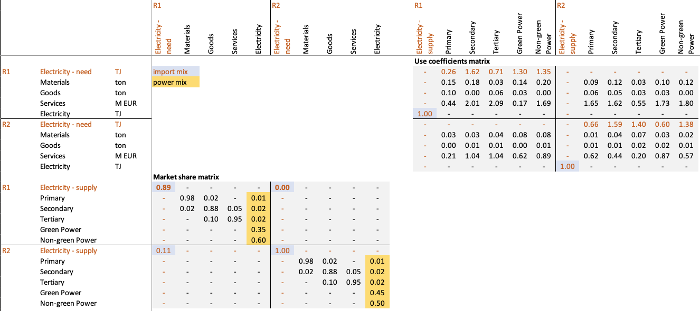

# nxsut 3.0 - Global Environmentally-Extended Supply-Use table in physical units

This repository contains the code required to generate the supply-use database for environmental impact analysis built by [**eNextGen**](https://enextgen.it/en/) and the SESAM research group of Politecnico di Milano
on top of [**EXIOBASE Hybrid v3.3.18**](https://zenodo.org/records/10148587) with [**MARIO**](https://github.com/it-is-me-mario/MARIO).

The database for 2023-2025 is available on [**Zenodo**](10.5281/zenodo.21638002)

## How it is built

The original EXIOBASE database is updated in terms of electricity supply (from [EMBER](https://ember-energy.org/)) 
and trade mixes (from [ENTSOE](https://transparency.entsoe.eu)) to represent electricity production and trade of 2025. 
ENTSOE provides data only for European countries: development releases - for internal use only - of *nxsut* included other data from other sources to represent electricity trades for non-EU countries.
*nxsut 3.0*, however, relies only on ENTSOE for licensing purposes. Plus, we did not notice significant differences in electricity carbon footprint of non-EU countries even without applying trade corrections. 

Electricity commodity is *pooled*: this means that, although the original database is in [Isard format](https://mario-suite.readthedocs.io/en/latest/user_guide/transformations/to_chenery_moses.html),
a fictitious activity - *Electricity - supply* - is introduced in each region, absorbing all domestic and imported consumption of electricity of its region. Electricity trade is then represented on the supply matrix,
with a "Chenery-Moses-like" arrangement, where in each region, all *Electricity - supply* activities domestically produce or export a fictitious commodity - *Electricity - need*.
A didactic example is described on the [MARIO documentation](https://mario-suite.readthedocs.io/en/latest/user_guide/advanced/electricity_mix.html)

The nxsut builiding pipeline imports also the procedure provided by [Ghezzi et al](https://doi.org/10.1021/acs.est.5c15099) to introduce
+20 new activities related to innovative steelmaking technologies, including hydrogen production. 
Ghezzi et al also introduce a reallocation of blast furnace gases emissions to the iron and steel manufacturing activity, 
which makes both electricity and steel carbon footprint more aligned to literature ranges in most regions.  

Raw inputs are progressively governed in [**nxbase**](https://enextgen.it/products/nxbase/), the eNextGen data backbone, and reach
this pipeline through nxbase's public read-only API (see *Data access* below).

## Rationale

*nxsut* core use cases are **carbon footprinting** and **modelling**: while the original EXIOBASE Hybrid database refer to 2011, 
we strongly believe using it in 2026 for these specific purposes still makes a lot of sense, thanks to its physical-unit representation of the global economy and to the workflow we put together 
to align its result to more recent literature, where it matters most. A [blogpost on eNextGen's website](https://enextgen.it/en/analyses/electricity-carbon-footprint/)
shows how electricity carbon footprints from nxsut compares with the most authoritative sources in literature. Carbon footprint of steel are aligned to the one showed in Ghezzi et al.
Other work is ongoing - *see section below* - to make these data easily updatable over time and pragmatically useful for these applications. 

## Contents

| Path | What it is |
| --- | --- |
| `gen_v3.ipynb` | v3.0 generator (**current**): MARIO-native pipeline, EMBER supply mix + open ENTSO-E trade mix via the nxbase query API. Fully open input chain — the publishable version. |
| `support/` | Adapters and input files (aggregation maps, EMBER remapping, the nxbase query client) — being retrofitted into nxbase sources per WP0. |
| `paths.yml` | Public template for the per-user paths to raw inputs (EXIOBASE flows, EMBER release) and export target. Fill in your real paths. |

## Requirements

- Python with `mario`, instructions [here](https://mario-suite.readthedocs.io/en/latest/setup/index.html)
- EXIOBASE Hybrid v3.3.18 flow files (paths to be configured in `paths.yml`). Note MARIO has an [automatic database downloader](https://mario-suite.readthedocs.io/en/latest/notebooks/parsers/exiobase/hybrid.html#Optional-download-step)

## Data access

The pipeline reads its input data — EMBER electricity supply mixes and ENTSO-E
bilateral trades — from **nxbase's public read-only query API**. You do **not**
need an nxbase checkout (the nxbase repository is currently private): the API serves the
open-access sources **anonymously**, with no login or key.

- The API base URL is `nxbase_api` in `paths.yml`
  (default `https://enextgen.it/nxbase-api`).
- `support/nxbase_client.py` wraps the calls (`/data.csv`, `/sets/*`) and
  reshapes the rows into the structures MARIO consumes.
- Only open-visibility sources are anonymously reachable (EMBER generation,
  ENTSO-E trades, and the published nxsut releases).

## Versioning

- **v1.0 / v2.0** — legacy supply-mix / + bilateral electricity trades on the
  proprietary Electricity Maps mix. **Internal use only, not in this public
  repository** (`gen_v1.ipynb` / `gen_v2.ipynb` are git-ignored — the mix is not
  redistributable).
- **v2.1** — *retired* (2026-07-21): the MARIO-native pipeline on the
  proprietary Electricity Maps mix. Superseded by v3.0, same pipeline on an
  open mix.
- **v3.0 (current)** — MARIO-native pipeline, open ENTSO-E trade mix
  (`gen_v3.ipynb`). Fully open input chain — the publishable version.

## Ongoing work

- A paper on embedding photovoltaic supply chain is currently under review and will be hopefully embedded soon
- Updates of supply and trade mixes is under investigation for other commodities

## License

Licensed under **Creative Commons Attribution-ShareAlike 4.0 International
(CC BY-SA 4.0)** — see [`LICENSE`](LICENSE). Share and adapt for any purpose,
including commercially, with appropriate credit and under the same license
(ShareAlike). nxsut derives from EXIOBASE Hybrid v3.3.18 (CC BY-SA 4.0), so the
ShareAlike term is inherited.

Copyright © 2026 Nicolò Golinucci (eNextGen), Lorenzo Rinaldi (Department of Energy, Politecnico di Milano). Attribute as:
*"nxsut 3.0 — Nicolò Golinucci & Lorenzo Rinaldi, eNextGen (CC BY-SA 4.0)"*.
